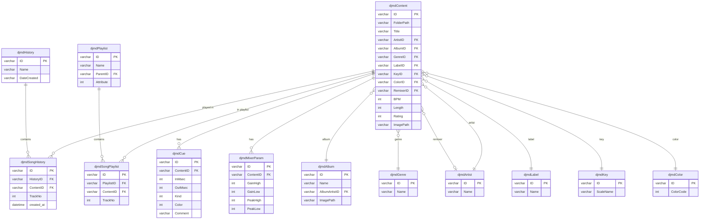

# Rekordbox Database Schema Diagram

Entity relationship diagram for the Rekordbox 6/7 database.

## Key Relationships

| Foreign Key | References |
|-------------|------------|
| djmdSongHistory.HistoryID | djmdHistory.ID |
| djmdSongHistory.ContentID | djmdContent.ID |
| djmdContent.ArtistID | djmdArtist.ID |
| djmdContent.AlbumID | djmdAlbum.ID |
| djmdContent.GenreID | djmdGenre.ID |
| djmdContent.LabelID | djmdLabel.ID |
| djmdContent.KeyID | djmdKey.ID |
| djmdContent.ColorID | djmdColor.ID |
| djmdContent.RemixerID | djmdArtist.ID |
| djmdSongPlaylist.PlaylistID | djmdPlaylist.ID |
| djmdSongPlaylist.ContentID | djmdContent.ID |
| djmdCue.ContentID | djmdContent.ID |
